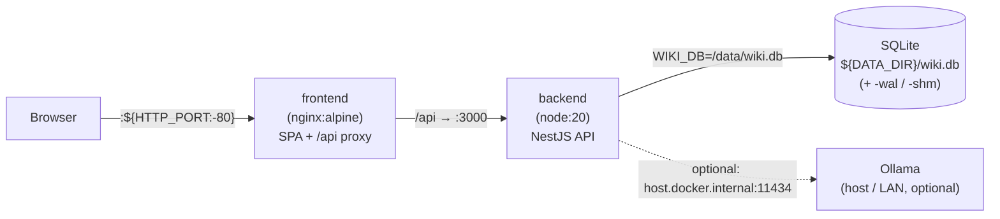

# 📚 Wikit

A tiny, **self-hosted personal wiki**. Markdown articles, instant search, a relationship graph and
dark mode — all backed by a single SQLite file. Light enough to run on a Raspberry Pi, generic
enough for any topic: dev notes, ops runbooks, study notes, recipes — whatever you want.

> No login, no cloud, no accounts. One `.db` file, your data stays on your machine. Run it bare-metal
> (a single process on one port) or as a small Docker stack — see [deployment](#docker-deployment-recommended).

## Features

- **Markdown articles** with server-side syntax highlighting (Shiki: JS, Python, Java, Bash, XML, JSON, SQL, …)
- **Instant search** (`Ctrl/Cmd + K`) over titles, tags and categories (Fuse.js), plus server-side full-text search (SQLite FTS5)
- **Edit in the browser** with a split-view Markdown editor and live preview (CodeMirror)
- **Categories & tags**, flexible and extensible
- **Per-article table of contents** with scroll-spy (generated from your headings)
- **Relationship graph**: link articles with typed relations and explore them visually (Vue Flow)
- **Java code analysis**: paste/upload `.java` (sidebar **"Java analysieren"**), parse it locally (no JDK), explore a dependency graph, export any class as a searchable wiki article, then run a **queued, streamed AI analysis** (Ollama) that describes the class and every method live on the article — optionally enriched with your own **project context** (e.g. Windchill)
- **Light & dark mode**
- **One SQLite file** as the database → backup = copy the file

## Tech stack

| Layer     | Tech |
|-----------|------|
| Frontend  | Vue 3 (Composition API), Vite, Vue Router, TailwindCSS v4, Fuse.js, Vue Flow, CodeMirror |
| Backend   | Node.js, NestJS (TypeScript), TypeORM (better-sqlite3 driver) |
| Rendering | markdown-it + Shiki + sanitize-html (server-side; result cached in the DB) |
| Java parsing | `java-parser` (pure JS, no JDK/`javac` — runs on a Pi/ARM64) |
| AI summaries | [Ollama](https://ollama.com) — optional, local, no API key (defaults to `qwen2.5-coder:3b`) |
| Database  | SQLite with a normalized schema (articles, categories, tags, relations) + FTS5 (full-text index kept via raw SQL — TypeORM has no FTS5 support) |

## Architecture

```text
Browser (Vue 3 SPA)  ──/api──►  NestJS  ──TypeORM──►  SQLite (better-sqlite3 + FTS5)
        ▲                            │
        └──── static SPA  ◄──────────┘     (one process, one port)
```

Markdown is rendered **once on save** (HTML + table of contents cached in the DB), so reading is
instant and the client bundle stays small. The NestJS backend compiles to plain JavaScript
(`backend/dist`) — at runtime it's still a single Node process serving the API + SPA on one port.

## Quick start

Requires **Node.js ≥ 20**.

```bash
npm install        # installs backend + frontend (npm workspaces)
npm run dev        # NestJS API on :3000 (nest start --watch) + Vite dev on :5173 (proxied)
# open http://localhost:5173
```

On first run an SQLite database is created and seeded with a few demo articles.

### Production

```bash
npm run build      # backend (nest build -> backend/dist) + frontend (-> frontend/dist)
npm start          # runs node backend/dist/main.js — serves API + SPA on one port
# open http://localhost:3000
```

> **Note:** the backend is TypeScript now, so `npm run build` is required before `npm start`
> (and after pulling updates). `npm run dev` compiles on the fly and needs no separate build.

## Your data stays local

This repo ships only the **app** and a small generic **demo seed**. Everything you create is
git-ignored, so publishing or pulling updates never touches your notes:

| What | Where | Tracked by git? |
|------|-------|-----------------|
| Your knowledge base | `backend/data/wiki.db` | ❌ ignored |
| Your personal seed (optional) | `backend/seed/articles/`, `backend/seed/manifest.js` | ❌ ignored |
| Demo seed (shipped) | `backend/seed/articles.example/`, `manifest.example.js` | ✅ committed |

On first run the seeder uses your `backend/seed/manifest.js` if it exists, otherwise it falls back
to the demo. To reset everything, delete `backend/data/wiki.db*` and restart.

**Name your instance:** copy `.env.example` to `.env` and set `VITE_WIKI_TITLE=My Notes`.

## Java code analysis

Open the **Java Analyzer** (code icon in the top bar, route `/java`):

1. **Paste or upload** a `.java` file and click **Analyze**. The source is parsed **locally** with
   `java-parser` (pure JS — no JDK, no `javac`). Class, methods, parameters, imports and Javadoc are
   extracted and stored.
2. **Explore the graph.** Classes become nodes (colored by type: class / interface / enum /
   annotation); edges are import dependencies **between analyzed classes** (external imports like
   `java.util.List` are listed in the detail panel, not drawn).
3. **Inspect & export.** Click a node to open the detail panel: per-method signature, Javadoc and an
   optional AI summary. **"Wiki-Artikel erstellen"** turns the class into a normal Markdown article —
   from then on it shows up in the sidebar and is **full-text searchable** (FTS5) like any other note.

> It's *code analysis with AI summaries*, not an "AI search": a class becomes searchable once you
> export it as an article.

### Enabling AI summaries (Ollama)

AI summaries are **optional** and powered by a **separate, local** [Ollama](https://ollama.com)
server — it does **not** start with Wikit. Without it everything works; method summaries simply fall
back to the parsed Javadoc.

```bash
# Linux / Raspberry Pi:
curl -fsSL https://ollama.com/install.sh | sh
# Windows / macOS: download the installer from https://ollama.com

ollama pull qwen2.5-coder:3b   # ~2 GB, code-tuned, small enough for a Pi
ollama list                    # verify it's there; the server listens on :11434
```

Then start Wikit, open a wiki article linked to a Java class and click **"KI-Analyse starten"**:
the class summary and each method description are generated sequentially by a server-side queue and
streamed onto the page via Server-Sent Events (no reload). Click an individual method name to
regenerate just that one. An optional **project context** field (e.g. Windchill background) is added
to every prompt, and previously analyzed methods feed back in as context via a Java FTS5 index.

You can run the model server three ways:

| Setup | How |
|---|---|
| **A. Same host** (default) | Install Ollama on the Wikit machine — nothing else to configure. |
| **B. Stronger LAN machine** | Run Ollama on a desktop (`OLLAMA_HOST=0.0.0.0 ollama serve`) and point Wikit at it: `OLLAMA_URL=http://<host>:11434/api/generate`. |
| **C. No AI** | Don't install Ollama — summaries use the Javadoc fallback. |

Configuration (all optional, set as env vars):

| Variable | Default | Purpose |
|---|---|---|
| `OLLAMA_URL` | `http://localhost:11434/api/generate` | Ollama `generate` endpoint |
| `OLLAMA_MODEL` | `qwen2.5-coder:3b` | model to use (e.g. `phi3:mini`, `mistral:7b`) |
| `OLLAMA_TIMEOUT_MS` | `20000` | abort + fall back if the model is too slow |

## Docker deployment (recommended)

The recommended way to run Wikit on a Raspberry Pi is **two containers** managed by Docker Compose:
an **nginx** container serves the built SPA and reverse-proxies `/api`, and a **Node** container runs
the NestJS API. The SQLite database lives on the **host** (bind-mount), so it survives image rebuilds.



Why split? The backend image contains **no** `frontend/dist`, so its `ServeStaticModule`
auto-disables and it serves the API only — nginx handles static files, SPA history-fallback,
gzip and the SSE stream. Clean separation, independently rebuildable.

### Prerequisites

- **Docker Engine + Docker Compose v2** on the Pi (ARM64):
  ```bash
  curl -fsSL https://get.docker.com | sh
  sudo usermod -aG docker $USER   # re-login afterwards
  ```
- **Portainer CE** (optional, web UI for containers/stacks):
  ```bash
  docker volume create portainer_data
  docker run -d -p 9443:9443 --name portainer --restart=always \
    -v /var/run/docker.sock:/var/run/docker.sock \
    -v portainer_data:/data portainer/portainer-ce:latest
  # then open https://raspberrypi.local:9443
  ```

> **better-sqlite3 is a native module.** Build the images on the **same architecture** they run on.
> On the Pi that means building **natively on ARM64** (the CI/CD runner below does exactly this).
> On an x86 dev machine, `docker compose build` produces x86 images for local testing; to produce
> ARM64 images on x86 you'd need `docker buildx --platform linux/arm64` (QEMU emulation, slow) — the
> self-hosted-runner approach avoids this entirely.

### First deploy

```bash
sudo mkdir -p /opt/wikit/data
sudo chown -R 1000:1000 /opt/wikit/data   # backend runs as non-root UID 1000 ("node")

git clone https://github.com/leuteritz/wikit /opt/wikit/app && cd /opt/wikit/app
cp .env.example .env       # set VITE_WIKI_TITLE, HTTP_PORT, DATA_DIR=/opt/wikit/data
docker compose up -d --build
# open http://raspberrypi.local
```

On first start the SQLite DB is created in `${DATA_DIR}` and seeded with the demo articles.

### Data persistence & backup

The whole knowledge base is one SQLite file (plus its WAL sidecars) under your `DATA_DIR`:

```bash
# Backup (WAL mode -> copy all three; the running DB is fine to copy with sqlite WAL):
cp -a /opt/wikit/data /opt/wikit/backups/wiki-$(date +%F)
# Restore: docker compose down, copy the directory back, docker compose up -d
```

Because the DB is a host bind-mount, `docker compose down` / image rebuilds **never** touch it.

### Portainer

Manage the stack from Portainer instead of the CLI:
**Stacks → Add stack → Repository**, point it at this repo and `docker-compose.yml`, add the same
environment variables (`HTTP_PORT`, `DATA_DIR`, `VITE_WIKI_TITLE`, optional `OLLAMA_*`), deploy.
The web build-arg `VITE_WIKI_TITLE` is read from the stack environment.

### Ollama from the container

The compose file maps `host.docker.internal` to the host gateway, so if Ollama runs on the Pi itself:

```env
OLLAMA_URL=http://host.docker.internal:11434/api/generate
```

(Or point at a stronger LAN machine: `OLLAMA_URL=http://192.168.1.50:11434/api/generate`.) Ensure
Ollama listens on all interfaces in that case (`OLLAMA_HOST=0.0.0.0`). No Ollama → Javadoc fallback,
nothing breaks.

## CI/CD: auto-deploy on push

**Recommended: GitHub Actions self-hosted runner on the Pi.** A home network usually has **no public
IP**, so an inbound webhook is awkward. A self-hosted runner instead **polls GitHub outbound** over
HTTPS — no open ports — and builds **natively on ARM64**, sidestepping the better-sqlite3
cross-compile problem. Flow: `push to master` → runner on the Pi → `docker compose up -d --build`.

The workflow lives in [`.github/workflows/deploy.yml`](.github/workflows/deploy.yml): a fast
GitHub-hosted `build-check` gate (`npm ci && npm run build`) runs first; only if it passes does the
self-hosted `deploy` job rebuild and restart the containers.

> ⚠️ `.github/` must be **tracked by git** (it was previously git-ignored). It is now committed so the
> workflow actually reaches GitHub.

### Set up the self-hosted runner

On the Pi (from the repo: **Settings → Actions → Runners → New self-hosted runner**, Linux/ARM64):

```bash
mkdir -p ~/actions-runner && cd ~/actions-runner
curl -o runner.tar.gz -L <URL-from-GitHub-for-linux-arm64>
tar xzf runner.tar.gz
./config.sh --url https://github.com/leuteritz/wikit --token <TOKEN> \
            --labels self-hosted,linux,ARM64
sudo ./svc.sh install      # run the runner as a service (survives reboots)
sudo ./svc.sh start
```

The runner needs Docker access (`sudo usermod -aG docker $USER`). Provide the persistent env file
**once** (the checkout is gitignore-clean and has no `.env`):

```bash
sudo mkdir -p /opt/wikit
sudo cp /opt/wikit/app/.env /opt/wikit/.env   # contains DATA_DIR=/opt/wikit/data
```

The deploy job copies `/opt/wikit/.env` into the checkout before running compose. Now every push to
`master` redeploys automatically; trigger manually via **Actions → Deploy to Raspberry Pi → Run
workflow**.

### Alternative: Watchtower + ghcr.io

If you prefer not to maintain a runner: build multi-arch images in a GitHub-hosted workflow
(`docker buildx build --platform linux/arm64,linux/amd64`, ARM64 via QEMU — slower, and native
better-sqlite3 under emulation is finicky), push them to `ghcr.io`, and run
[Watchtower](https://containrrr.dev/watchtower/) on the Pi to poll for new images and restart the
stack. Simpler ops, heavier/slower builds — hence the runner is the primary path here.

## Migration from systemd

If you previously ran Wikit via the bare-metal systemd unit, stop and disable it before switching to
Docker (otherwise both fight over port 3000 / the DB file):

```bash
sudo systemctl stop wikit
sudo systemctl disable wikit
sudo rm /etc/systemd/system/wikit.service
sudo systemctl daemon-reload
# migrate your data: copy the old DB to the new bind-mount location
cp -a ~/wikit/backend/data/. /opt/wikit/data/
sudo chown -R 1000:1000 /opt/wikit/data
```

## Deploy on a Raspberry Pi (bare-metal / legacy)

> The Docker path above is recommended. This bare-metal route (systemd + `npm start`) still works and
> is kept for setups that don't want Docker.

```bash
# Node 20 LTS (the distro package can be old)
curl -fsSL https://deb.nodesource.com/setup_20.x | sudo -E bash -
sudo apt install -y nodejs build-essential python3   # build tools for native better-sqlite3 (ARM64)

git clone https://github.com/leuteritz/wikit wikit && cd wikit
npm install
npm run build
npm start          # reachable at http://raspberrypi.local:3000
```

### Optional: AI summaries on the Pi

Ollama runs on a Pi 4/5 (ARM64), but a 7B model is slow — stick to a small, code-tuned one like
`qwen2.5-coder:3b`, and remember generation is **on demand / queued**, so the rest of the app stays
snappy:

```bash
curl -fsSL https://ollama.com/install.sh | sh   # installs + enables the `ollama` systemd service
ollama pull qwen2.5-coder:3b
```

If the Pi feels too slow, run Ollama on a stronger machine in your LAN and point Wikit at it via
`OLLAMA_URL` (see [setup B](#enabling-ai-summaries-ollama)). With no Ollama at all, summaries simply
fall back to the Javadoc — nothing breaks.

### Auto-start with systemd

```bash
sudo cp deploy/wikit.service /etc/systemd/system/
# adjust User / WorkingDirectory inside the file
sudo systemctl daemon-reload
sudo systemctl enable --now wikit
```

### Backup & restore

The entire knowledge base is one file:

```bash
cp backend/data/wiki.db ~/backups/wiki-$(date +%F).db   # backup
# restore: stop service, copy the file back, start service
```

## REST API (short)

| Method | Path | Purpose |
|---|---|---|
| GET | `/api/articles` | list (sidebar / search) |
| GET | `/api/articles/:slug` | full article (HTML, TOC, relations) |
| POST / PUT / DELETE | `/api/articles[/:id]` | create / update / delete |
| GET | `/api/categories`, `/api/tags` | taxonomy |
| GET | `/api/search?q=` | FTS5 full-text search |
| GET / POST / DELETE | `/api/relations[/:id]` | the graph |
| POST | `/api/java/analyze` | parse a `.java` source, store it, return file + graph |
| GET | `/api/java/files`, `/api/java/files/:id` | analyzed files (list / detail) |
| GET | `/api/java/graph` | global class dependency graph (with AI indicators) |
| GET | `/api/java/files/by-article/:articleId` | java file linked to a wiki article (or 404) |
| POST | `/api/java/methods/:id/summarize` | (re)generate an AI summary for a single method (Ollama) |
| PUT / DELETE | `/api/java/files/:id` | link an article / delete the file |
| POST | `/api/analysis/:articleId/start` | queue a full AI analysis (class + every method) of a linked java class |
| GET | `/api/analysis/stream/:articleId` | Server-Sent Events: live progress of the queued analysis |

## License

[MIT](LICENSE) © 2026 Adrian Leuteritz
