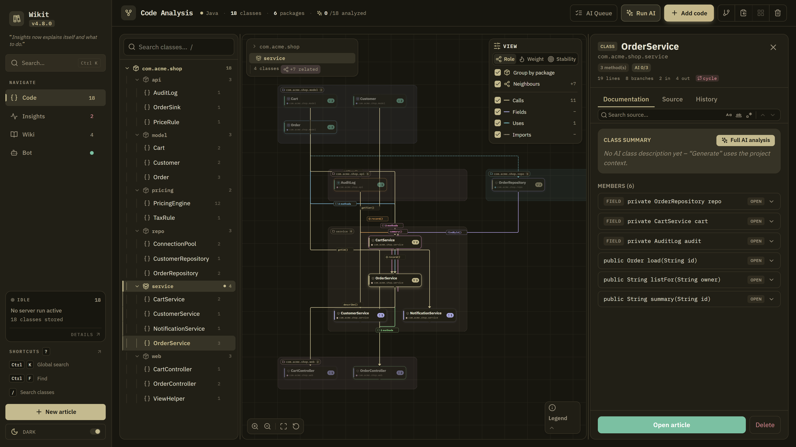

<h1>
  
  &nbsp;Wikit
</h1>

A tiny, self-hosted personal wiki — light enough for a Raspberry Pi.

[](LICENSE)
[](https://github.com/leuteritz/wikit/actions/workflows/deploy.yml)



Markdown articles with full-text search, a relationship graph and local Java code analysis. No
login, no cloud, no accounts — the whole knowledge base is a single SQLite file, so backup is
copying one file.

## Features

- **Markdown editor** — split view (CodeMirror); HTML is rendered once on save, server-side, with
  Shiki syntax highlighting.
- **Instant search** — `Ctrl/Cmd + K` over articles, classes, methods and raw source, backed by
  SQLite **FTS5**.
- **Relationship graph** — typed links between articles, drawn with [Vue Flow](https://vueflow.dev).
- **Java code analysis** — parse `.java` locally (no JDK) and explore a class dependency graph.
- **AI summaries** — optional, per method and per class, via [Ollama](https://ollama.com)
  (local, no API key), configurable at runtime under `/bot`.
- **Dark mode** and **backup = copy one file**.

## Tech stack

| Layer    | Tech |
|----------|------|
| Frontend | Vue 3 (Composition API) · Vite · TailwindCSS v4 · Vue Flow · CodeMirror · Fuse.js |
| Backend  | NestJS 11 (TypeScript) · TypeORM (better-sqlite3) |
| Content  | markdown-it + Shiki + sanitize-html (server-side, cached in the DB) |
| Database | SQLite + FTS5 full-text index |
| AI       | [Ollama](https://ollama.com) — optional, local, no API key (default `qwen2.5-coder:3b`) |

An **nginx** container serves the built SPA and proxies `/api` to the **NestJS** backend; SQLite
lives on the host as a bind-mount.

## Deploy (Docker)

```bash
git clone https://github.com/leuteritz/wikit && cd wikit
cp .env.example .env          # then edit — see below
docker compose up -d --build
# open http://<host>:${HTTP_PORT}   (default http://localhost)
```

On first start the DB is created under `DATA_DIR` and seeded with a few demo articles.

> **`better-sqlite3` is native** — build the images on the architecture they run on (on a Pi:
> natively ARM64). Cross-building needs `docker buildx --platform linux/arm64` (QEMU, slow).

### Configuration (`.env`)

| Variable | Default | Purpose |
|---|---|---|
| `VITE_WIKI_TITLE` | `Wikit` | Name in header and tab. **Baked in at build time** — change it and rebuild. |
| `HTTP_PORT` | `80` | Public port of the nginx frontend. |
| `DATA_DIR` | `./data` | Host directory holding the SQLite DB (mounted to `/data`). On a Pi use an **absolute** path owned by UID `1000`. |
| `OLLAMA_URL` | `http://localhost:11434/api/generate` | Ollama endpoint. In Docker: `http://host.docker.internal:11434/api/generate`. |
| `OLLAMA_MODEL` | `qwen2.5-coder:3b` | Model for AI summaries. |
| `OLLAMA_TIMEOUT_MS` | `20000` | Abort and fall back to Javadoc if the model is too slow. |
| `WIKI_BODY_LIMIT` | `64mb` | Largest accepted body. Raising it means raising `client_max_body_size` in `deploy/nginx.conf` too — nginx rejects first otherwise. |

The three `OLLAMA_*` values are only the **default**; anything set under `/bot` wins. `PORT`, `HOST`
and `WIKI_DB` in `.env.example` are for bare-metal runs only.

## Java code analysis

1. **Add code.** Paste or drop `.java` files anywhere on the view. Sources are parsed **locally**
   with `java-parser` (pure JS — no JDK); classes, members, parameters, imports and Javadoc are
   stored.
2. **Explore the graph.** Each card says what a class **is** (class / interface / enum / record /
   utility / …) and how it **connects** (source / consumer / hub / isolated); classes are grouped
   into package zones. Edges are method calls, field accesses, type usages and plain imports — click
   one and the detail column shows the definition and every call site, down to the line.
3. **Search.** `Ctrl/Cmd + K` searches names *and* raw source with match case, whole word and regex;
   a second box inside the graph highlights classes, packages and method names without moving
   anything.
4. **Export.** Turn a class into a normal Markdown article — from then on it is full-text
   searchable like any other note.

## AI summaries (Ollama)

Optional. Without Ollama everything works; summaries fall back to the parsed Javadoc.

```bash
curl -fsSL https://ollama.com/install.sh | sh   # Linux / Pi
ollama pull qwen2.5-coder:3b                     # ~2 GB, code-tuned, small enough for a Pi
```

Host, model, sampling and the prompts themselves are configured at runtime under `/bot` — no
restart. Summaries are generated by a server-side queue and streamed onto the page (SSE). Ollama may
run on the same host or on a stronger LAN machine (`OLLAMA_HOST=0.0.0.0 ollama serve`).

## Backup

The whole knowledge base is **one SQLite file** (plus its `-wal` / `-shm` sidecars) under
`DATA_DIR`. It is a host bind-mount, so rebuilds and `docker compose down` never touch it.

```bash
cp -a /opt/wikit/data /opt/wikit/backups/wiki-$(date +%F)   # WAL-safe while running
```

## CI/CD

A self-hosted runner on the Pi gives push-to-deploy without any inbound port. Register it with
`--labels self-hosted,linux,ARM64`, give it Docker access (`usermod -aG docker $USER`) and place the
env file once at `/opt/wikit/.env`. Every push to `master` then runs `build-check` on GitHub and, on
success, `docker compose up -d --build` on the Pi — see
[`.github/workflows/deploy.yml`](.github/workflows/deploy.yml).

## License

[MIT](LICENSE) © 2026 Adrian Leuteritz
